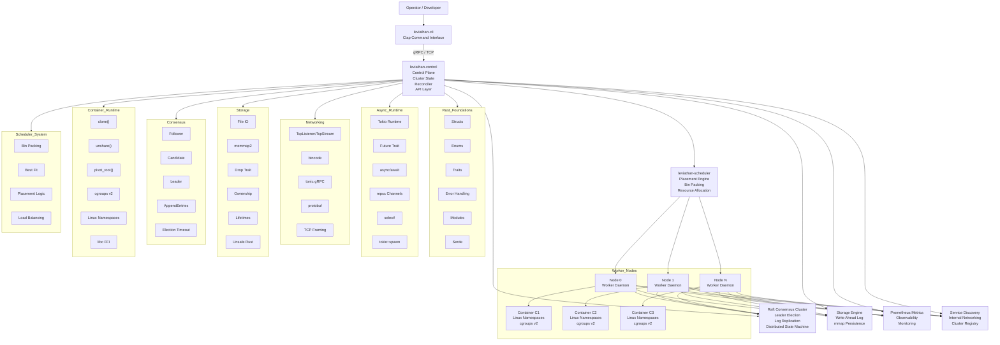

```
██╗     ███████╗██╗   ██╗██╗ █████╗ ████████╗██╗  ██╗ █████╗ ███╗   ██╗
██║     ██╔════╝██║   ██║██║██╔══██╗╚══██╔══╝██║  ██║██╔══██╗████╗  ██║
██║     █████╗  ██║   ██║██║███████║   ██║   ███████║███████║██╔██╗ ██║
██║     ██╔══╝  ╚██╗ ██╔╝██║██╔══██║   ██║   ██╔══██║██╔══██║██║╚██╗██║
███████╗███████╗ ╚████╔╝ ██║██║  ██║   ██║   ██║  ██║██║  ██║██║ ╚████║
╚══════╝╚══════╝  ╚═══╝  ╚═╝╚═╝  ╚═╝   ╚═╝   ╚═╝  ╚═╝╚═╝  ╚═╝╚═╝  ╚═══╝
```

> **☠ A Distributed Container Orchestration System Written From Scratch In Rust.**


---

## What is this?

Leviathan is a minimal container orchestration platform — think Kubernetes, but
built from first principles entirely in Rust. It is not a tutorial project. It is
a deliberate, structured exercise in systems engineering: distributed consensus,
container isolation, resource scheduling, and self-healing networking, all wired
together from scratch. No shortcuts. No magic frameworks doing the hard parts.



---

## 7-Day Build Roadmap

| Day | Focus | Rust Concepts | Status |
|-----|-------|---------------|--------|
| **1** | Project init · Cargo workspace · CLI skeleton · Core types | Structs · Enums · Traits · Error handling · Modules | ✅ Completed |
| **2** | Async runtime · Tokio tasks · Channels · Node heartbeat loop | `Future` · `async/await` · `mpsc` · `select!` · `spawn` | ✅ Completed |
| **3** | TCP networking · Node communication protocol · Serialization | Sockets · `TcpListener` · `bincode` · `protobuf` · Framing | ✅ Completed |
| **4** | Storage engine · Write-ahead log · `mmap` | File I/O · `mmap` · Lifetimes · Ownership · `unsafe` | ✅ Completed |
| **5** | Raft consensus · Leader election · Log replication | State machines · `Arc<Mutex<>>` · `unsafe` · Term logic | ✅ Completed |
| **6** | Container runtime · Linux namespaces · cgroups | `unsafe Rust` · FFI · `clone()` · `unshare()` · `pivot_root` | ✅ Completed |
| **7** | Scheduler · Service mesh · Prometheus metrics · Integration | Full system integration · Placement algorithms · Observability | ✅ Completed |

---

## Rust Concepts Covered

### Phase 1 — Foundations (Day 1)
- Structs, Enums, newtype pattern
- Trait definitions and implementations
- Module system and `pub` visibility
- Error handling with `thiserror` and the `?` operator
- Serde: `Serialize` / `Deserialize` derive macros
- Cargo workspaces and multi-crate projects

### Phase 2 — Async (Day 2)
- The `Future` trait and the async executor model
- `async fn`, `.await`, and cooperative scheduling
- `tokio::spawn` for concurrent task execution
- `tokio::sync::mpsc` channels for message-passing
- `tokio::select!` for racing multiple futures
- Structured concurrency and cancellation safety

### Phase 3 — Networking (Day 3)
- `TcpListener` / `TcpStream` in async context
- Length-prefixed framing over raw TCP
- Binary serialization with `bincode`
- gRPC with `tonic` and `.proto` definitions
- Handling partial reads and connection resets

### Phase 4 — Storage (Day 4)
- File I/O with `std::fs` and `tokio::fs`
- Write-ahead logging (WAL) for crash recovery
- Memory-mapped files with `memmap2`
- Lifetime annotations and borrow checker at the boundary of `unsafe`
- The `Drop` trait and resource cleanup

### Phase 5 — Distributed Consensus (Day 5)
- Raft state machine: Follower / Candidate / Leader
- Leader election with randomised election timeouts
- Log replication: `AppendEntries` RPC
- `Arc<Mutex<T>>` for shared mutable state across tasks
- Handling split-brain and network partitions

### Phase 6 — Container Runtime (Day 6)
- Linux namespaces: `CLONE_NEWPID`, `CLONE_NEWNET`, `CLONE_NEWNS`
- Raw `clone()` syscall via `libc` FFI
- `unshare()` and `pivot_root()` for filesystem isolation
- cgroups v2: CPU and memory resource limits
- Writing `unsafe` Rust responsibly: invariants and documentation

### Phase 7 — Scheduler + Observability (Day 7)
- Bin-packing and best-fit scheduling algorithms
- Service discovery via distributed key-value store
- Prometheus exposition format: counters, gauges, histograms
- Full system integration testing

---

## Workspace Structure

```
leviathan/
├── Cargo.toml                  # Workspace root
├── Cargo.lock                  # Committed — this is a binary project
├── README.md
├── .gitignore
│
├── leviathan-cli/              # `leviathan` binary — operator interface
│   ├── Cargo.toml
│   └── src/
│       ├── main.rs
│       └── commands/
│           ├── mod.rs
│           ├── node.rs
│           ├── container.rs
│           └── cluster.rs
│
├── leviathan-core/             # Shared types, errors, traits
│   ├── Cargo.toml
│   └── src/
│       ├── lib.rs
│       ├── node.rs
│       ├── container.rs
│       ├── resources.rs
│       ├── error.rs
│       └── traits.rs
│
├── leviathan-node/             # Worker node daemon
│   ├── Cargo.toml
│   └── src/main.rs
│
├── leviathan-control/          # Control plane daemon
│   ├── Cargo.toml
│   └── src/main.rs
│
└── leviathan-scheduler/        # Placement scheduler
    ├── Cargo.toml
    └── src/main.rs
```

---

## Building

```bash
# Build all crates
cargo build

# Build only the CLI
cargo build -p leviathan-cli

# Run the CLI
cargo run -p leviathan-cli -- --help
cargo run -p leviathan-cli -- node start --id node-1 --addr 127.0.0.1:7001
cargo run -p leviathan-cli -- container run --image ubuntu:22.04 --name app
cargo run -p leviathan-cli -- cluster status
```

---

## Why This Project?

Because the gap between "knowing Rust" and "understanding systems" is enormous,
and most projects do not bridge it. Leviathan forces every hard problem into the
open: ownership across async boundaries, consensus under network partition,
container isolation through raw syscalls, and resource scheduling under
constraint. There is no framework to hide behind. Every abstraction gets built
twice — once wrong, then right.

